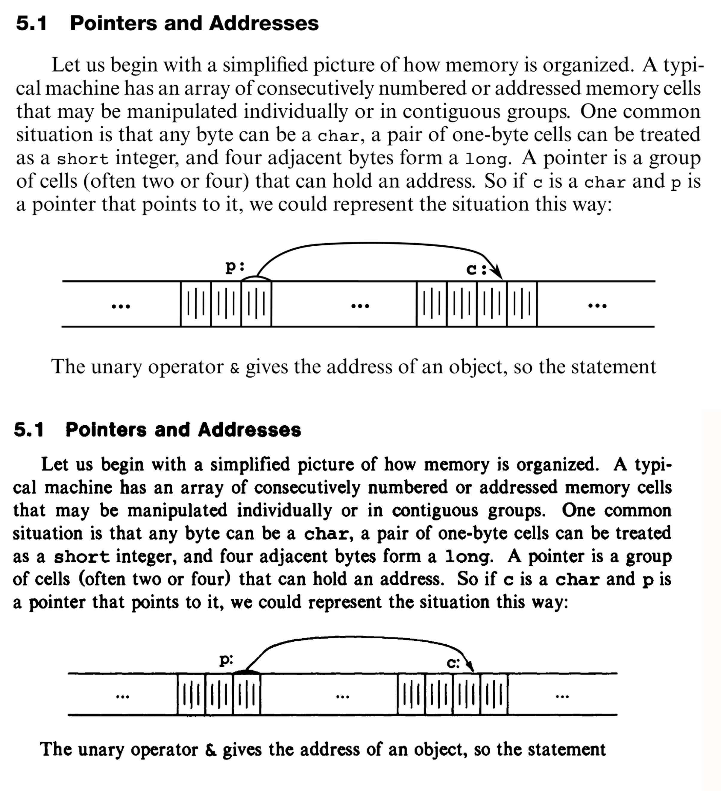
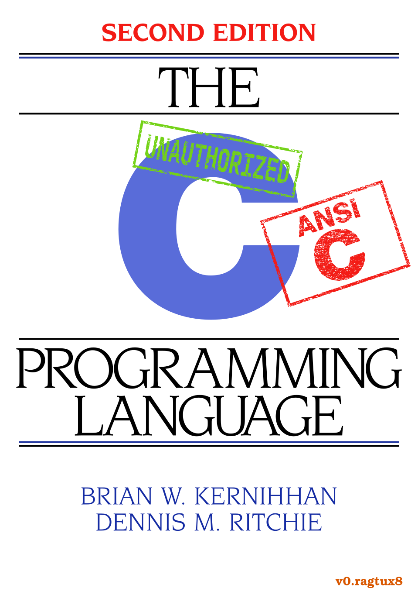

# Overview

I took on this project of extracting HTML and text from a PDF as an exercise of curiosity.

There's likely better ways to handle what I'm doing in this repo, but I like poking around things like this.

One thing to note: DO NOT PARSE OUT WOFF FILES AS THEY STAND. For some reason, it seems to change the locales or something.

Special characters are printed to the console that will ruin the output. I don't know how to fix this at the moment.

It's sort of like how you can change the terminal colors by printing special characters, and you have to print a reset char to set the color back to normal. It's like that, but with characters instead. It's quite something to look at.

The following is an output of the `ls` command in this repo after printing the WOFF files.

```sh
51Q┤▒┌␋├≤S▒└⎻┌␊.⎻┼±   README.└␍   R␊⎻┌␋␌▒C⎺┴␊⎼F␋┼▒┌.⎻┼±   ␉␋┼␍␋┼±.±≤⎻   ␉┤␋┌␍   ␌⎺└└⎺┼.±≤⎻␋   ␌⎺└⎻␋┌␊ ␌⎺└└▒┼␍⎽.┘⎽⎺┼   ␌⎺┼┴␊⎼⎽␋⎺┼.⎽␤  '┐&⎼ ┴0⎼▒±├┤│8.⎻␍°'   ┼⎺␍␊ └⎺␍┤┌␊⎽   ┼⎺␍␊└⎺┼.┘⎽⎺┼   ⎻▒␌┐▒±␊-┌⎺␌┐.┘⎽⎺┼   ⎻▒␌┐▒±␊.┘⎽⎺┼   ⎻␍°2␤├└┌EX   ⎽⎼␌   ├⎽␌⎺┼°␋±.┘⎽⎺┼   ┴␊┼┴
```

Prolly not a huge deal if you do print them, but just thought I'd let you know. A cheeky `reset` seems to fix the problem.

Maybe this is my lack of experience with working with fonts on a low level leaking through. Maybe this is obvious to more seasoned programmers: don't print font files maybe?

What I do know about these fonts though, is they transform three-bytes utf-8 sequences. This is the reason behind `FileConversion.cpp` in the first place: to read the three-byte utf-8 sequence and transform it back into a normal utf-8 sequence. The next step for this repo is to read the WOFF files and apply similar transforms there. There may be a need for another font, or it could be as simple as changing the font size on certain characters. I'm unsure, but the WOFF files have a different set of glyphs for A-Z for some reason. Likely just for sizing.

## Dependencies

Right now, these are notable dependencies due to them needing to be excluded from git tracking or vendoring into the project.

Just make sure `zlib` is in your system somehow. e.g. On Ubuntu: `sudo apt-get install zlib1g` (or whatever it is) if needed.

For `pdf2htmlEX` grab the appropriate binary from their releases page and put it in the project's dir following `.gitignore`'s nomenclature.

Or put it wherever. The world is your oyster.

* `zlib`
* `pdf2htmlEX`
  * https://github.com/pdf2htmlEX/pdf2htmlEX

K&R 2E
=====

Welcome to the unauthorized K&R 2E repository! K&R is an amazing book both in
terms of its lasting historical impact (it's 50 years old!) and in the timeless
quality of its technical writing. It is truly a computer science classic.

The impetus for this project was my frustration with the seemingly non-existent
good quality (typeset, non-scanned) pdfs available. I had purchased both the
first and the second edition of K&R and was looking to buy a good quality
(typeset) pdf for digital reference but couldn't find one.

The typesetting is entirely LaTeX. The advantages of LaTeX is that - if
organized well enough - one can easily "rice" a doument. Most of the graphics
were done in Inkscape. There are plenty of drawing packages in LaTeX (e.g.
TikZ) but I am largely unfamiliar with them. I would love to learn more about
LaTeX and include them if anyone can provide good looking working examples.

<p float="middle">


</p>

I did this originaly using XeLaTeX which allows the use of system fonts. Since
some of the fonts used are non-free. I am currently working on coverting everything
to a free font so that everyone can work on it.

Project Goals
-------------
There are two objectives:

- [ ] A "vanilla" version that is as true to the original K&R 2E (stock size,
   fonts, layout, coloring, etc.) as ***reasonably*** possible.

- [ ] A "super deluxe" version inspired by what the guys
   [here](https://github.com/sarabander/sicp-pdf) did with SICP.  I really
   enjoy the font combo and the syntax highlighting. I would also like this
   deluxe version to have all its exercises hyperlinked to the answers which
   will be at the back of the book. The answers will come from the second
   edition of [Clovis L. Tondo's official answer book](https://www.amazon.com/Answer-Book-Solutions-Exercises-Programming/dp/0131096532).

TODO
-------------
- [ ] Complete Appendix A, B, and C
- [ ] Organize source files and push to repository.
- [ ] Thorough layout error checking. These are hopefully little things like somethings wasn't italicized when it should have been, or something was indented inconsistently.
- [ ] Transcription and testing of [Clovis L. Tondo's official answer book (2e)](https://www.amazon.com/Answer-Book-Solutions-Exercises-Programming/dp/0131096532) for use in the deluxe version.

Legal
-------------
I do not own this work, nor do I ask for money. Please support the publisher and authors by purchasing an [official copy](https://www.amazon.com/Programming-Language-2nd-Brian-Kernighan/dp/0131103628/ref=sr_1_1?dchild=1&keywords=Programming-Language-2nd-Brian-Kernighan&qid=1601353364&sr=8-1).

That being said this work is nearing 50 years old, and C has had its time in
the sun. A quick search on Google or GitHub will reveal many other bootleg
copies of the book. So this project shouldn't stand out in that sense.
